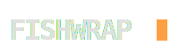

<div align="center">
  
  <br>
  <b>The algorithm you can read. The feed that ends.</b>
</div>

<br>

**Fishwrap** is a Glass-Box news engine. It transforms RSS feeds, Reddit threads, and Hacker News into finite, auditable HTML editions and stops. No infinite scroll. No black-box ranking. Every editorial decision lands in an audit log a human can read.

The engine ships as a signed OCI image at `ghcr.io/maxspevack/fishwrap`. Downstream products — newsletters, intranets, personal news pages — pull the image, mount a config, and run it.

👀 **See it in action:**
*   [The Daily Clamour](https://dailyclamour.com) — Live production instance, refreshes daily at 04:00 Pacific
*   [The Zero Day](https://fishwrap.org/demo/cyber/) — Cybersecurity demo
*   [The Hallucination](https://fishwrap.org/demo/ai/) — AI research demo
*   [The ShowRunner](https://fishwrap.org/demo/showrunner/) — Entertainment demo

---

## 🗞️ Quick Start

You need: Docker or Podman. That's it.

```bash
git clone https://github.com/maxspevack/fishwrap.git
cd fishwrap
mkdir -p output
docker run --rm \
    -v $(pwd)/demo:/cfg \
    -v $(pwd)/output:/output \
    ghcr.io/maxspevack/fishwrap:2.0 \
    fishwrap-build --config /cfg/config.py
```

The rendered edition lands at `output/index.html`. Open it.

To run a different vertical, swap the config path:

```bash
docker run --rm -v $(pwd)/demo:/cfg -v $(pwd)/output:/output \
    ghcr.io/maxspevack/fishwrap:2.0 \
    fishwrap-build --config /cfg/cyber_config.py
```

For the full consumer contract — every input, every output path, every CLI surface, the versioning policy, the pinning recommendation — read [**`docs/IMAGE_CONTRACT.md`**](docs/IMAGE_CONTRACT.md).

---

## 🧐 The Glass Box

Fishwrap is built on transparency over magic. Every editorial decision is visible.

*   **The Fetcher** scours your defined feeds (RSS, JSON, Reddit) using concurrent I/O. Failed feeds are logged, not hidden.
*   **The Editor** classifies each article into a section using your `KEYWORDS` table and applies your `EDITORIAL_POLICIES` (boosts and penalties) to compute an Impact Score. Every score is recorded, every policy that fired is named.
*   **The Auditor** runs after every edition and emits a Transparency Report (`transparency_fragment.html`) showing how much noise was filtered, which sources won, which articles barely made it, and which barely missed.
*   **The Enhancer** scrapes full text where possible so consumers don't click out. Rate-limited.
*   **The Printer** renders the final HTML against a Jinja2 theme of your choosing.

Behind the scenes is a SQLite "Newsroom" database that stores the article corpus during a run. In containerized contexts the database is ephemeral — every run starts fresh.

[**Read the engineering blog →**](https://fishwrap.org/engineering/)

---

## 🤝 Build Your Own

Fishwrap is the engine. Your publication is the config and the theme. To start your own fishwrap-powered news page:

1. Read [`docs/IMAGE_CONTRACT.md`](docs/IMAGE_CONTRACT.md) — what the image expects and produces.
2. Read [`docs/CONFIG_SCHEMA.md`](docs/CONFIG_SCHEMA.md) — every key the engine looks for.
3. Fork [Daily Clamour](https://github.com/maxspevack/dailyclamour.com) — the canonical example consumer, set up to refresh daily on GitHub Actions with Dependabot version pinning. Replace the config and theme; you're done.

---

## 📂 Repository Structure

*   **`fishwrap/`** — the stateless engine.
*   **`demo/`** — four reference configurations and themes (`vanilla`, `cyber`, `ai`, `showrunner`).
*   **`docs/`** — the source for [fishwrap.org](https://fishwrap.org), plus the consumer contract, ADRs, schema reference, and release notes.
*   **`Dockerfile`** — the release artifact recipe.
*   **`.github/workflows/`** — release and demo refresh workflows.

---

## 📚 Documentation

| | |
|---|---|
| [**Image Contract**](docs/IMAGE_CONTRACT.md) | Public contract for image consumers |
| [**Config Schema**](docs/CONFIG_SCHEMA.md) | Every key the engine recognizes |
| [**Release Notes**](docs/RELEASE_NOTES.md) | Version history |
| [**Releasing**](docs/RELEASING.md) | Runbook for cutting new versions |
| [**Contributing**](CONTRIBUTING.md) | How to contribute to the engine itself |
| [**Architecture Decisions**](docs/adr/) | ADRs for significant decisions |
| [**Versioning Policy**](docs/VERSIONING.md) | What patch / minor / major mean |

## 🗺️ What's Planned

The roadmap lives in GitHub. There is no separate roadmap document to keep in sync.

| | |
|---|---|
| [**Issues**](https://github.com/maxspevack/fishwrap/issues) | Everything open, in progress, and recently closed |
| [**Milestones**](https://github.com/maxspevack/fishwrap/milestones) | Versioned groupings of issues currently being worked on |

---

## 📜 License

Apache License 2.0.
