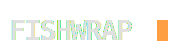

  
   
  <h3>The algorithm you can read. The feed that ends.</h3>

> "One of the insights of the Victorian Revival was that it was not necessarily a good thing for everyone to read a completely different newspaper in the morning; so the higher one rose in the society, the more similar one's Times became to one's peers'."
>
> — **Neal Stephenson**, *The Diamond Age*

> "The only criterion for a news item... was that it still had to seem interesting."
>
> — **Neal Stephenson**, *Anathem*

---

## The Manifesto: Aperture & Artifacts

We are drowning in infinite streams. Social media, news aggregators, and "For You" pages are designed to be bottomless black boxes. They optimize for **engagement**—often meaning rage or addiction—and hide their logic.

**Fishwrap is the "Anti-Feed."**

It is a "Glass-Box" briefing engine designed for the **Diamond Age** of information. It is built on radical ideas:

### 1. Finiteness is a Status Symbol
In a world of cheap, infinite content, the ultimate luxury is **an ending**.
Like the bespoke *Times* delivered to the elite in Stephenson's Neo-Victorian future, a newspaper should be an **Artifact**—a discrete object with a beginning, a middle, and a last page. Fishwrap transforms the chaos of the web into a finite HTML or PDF edition that you can read, finish, and put away. The peasants scroll; the elite read.

### 2. The Glass Box (Transparency)
Most feeds are black boxes. Fishwrap is a **Glass Box**.
The value of transparency isn't that you *will* tune the algorithm every day, but that you **can**. Trust comes from the **option to verify**. Our scoring logic is a clear, simple Python script (`scoring.py`) that you can audit, edit, and control. You are the Editor-in-Chief.

### 3. The Aperture of Time
In *Anathem*, the intellectuals filtered information through time to separate signal from noise.
We don't just aggregate; we condense. A single daily edition. We publish once per planetary rotation, prioritizing clarity over speed.

### 4. The Anxiety of the "Thumbs Down"
In the Black Box Era (Google News, TikTok), feedback is a trap.
*   **The Dilemma:** You see a fluff piece about a politician playing golf. If you click "Dislike," the algorithm might hide *all* news about that politician—even the important policy updates. If you do nothing, you get more golf.
*   **The Result:** Users live in fear of their own feeds. They "doomscroll" passively because active curation feels dangerous and unpredictable.
*   **The Solution:** **Granular Consent.** We don't ask for a "Thumbs Down." We ask for an Editor's Note: "Penalty: 'Golf' (-20). Boost: 'Executive Order' (+20)." You see the rule. You can delete it. You have agency.

---

## See it Live

The flagship implementation of Fishwrap is **The Daily Clamour**.

It runs on a strict schedule, publishing a finite edition once per day, every day at 04:00 AM Pacific.

---

---

## Try Fishwrap

Experience the "Anti-Feed" for yourself. Visit our [Demos page](/demo/) to see live examples and get quick-start instructions to run your own edition.

[View Demos & Get Started](/demo/){: .btn .btn-primary .fs-5 .mb-4 .mb-md-0 .mr-2 }
[View Source on GitHub](https://github.com/maxspevack/fishwrap){: .btn .btn-primary .fs-5 .mb-4 .mb-md-0 .mr-2 }
