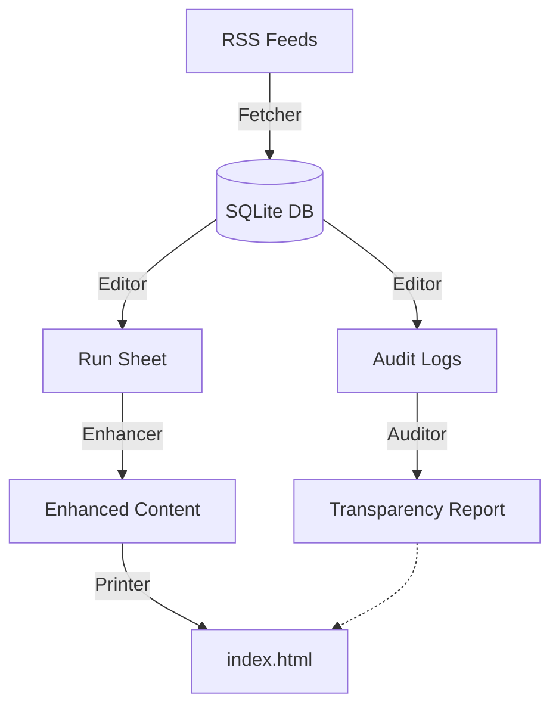

# Fishwrap Engine ⚙️

This directory contains the core source code for Fishwrap.

## The Glass Box Architecture 🏛️

Fishwrap is designed as a transparent, auditable pipeline. It doesn't just show you news; it tells you *why* it showed you news.

### 1. `fishwrap.fetcher` (The Ingestion)
*   **Parallel Execution:** Uses `ThreadPoolExecutor` to fetch dozens of feeds concurrently.
*   **Smart Upserts:** Merges new data with existing records in `newsroom.db` (SQLite), preventing data loss and handling history.
*   **Rate Limiting:** Respects `robots.txt` and implements Token Bucket rate limiting for polite scraping.

### 2. `fishwrap.editor` (The Brain)
*   **Classification:** Maps articles to sections (News, Tech, Sports) using Source Affinity and Keyword Heuristics.
*   **Scoring:** Calculates an "Impact Score" based on social signals (Votes/Comments) and Recency.
*   **The Jaccard Hatchet:** Efficiently deduplicates similar stories (O(N) complexity) to prevent echo chambers.
*   **Drift Detection:** Tracks when an article is forced into a section it doesn't belong to.

### 3. `fishwrap.auditor` (The Conscience)
*   **Forensics:** Analyzes every decision made by the Editor.
*   **The Funnel:** Tracks how many items were seen vs. how many were chosen ("Anti-Feed Protection").
*   **Source Efficiency:** Calculates which domains provide Signal vs. Noise.
*   **Output:** Generates `transparency_fragment.html`, which is injected into the final edition.

### 4. `fishwrap.enhancer` (The Body)
*   **Content Extraction:** Uses `newspaper3k` to scrape full text and authors for selected articles.
*   **Parallel Processing:** Enhances the entire run sheet in parallel for speed.

### 5. `fishwrap.printer` (The Face)
*   **Templating:** Uses `Jinja2` to render the final `index.html`.
*   **PDF Generation:** Uses `WeasyPrint` to generate a printable PDF edition.
*   **Self-Awareness:** Injects the engine version and git revision into the footer.

## Configuration

Fishwrap relies on a configuration file injected at runtime via the `FISHWRAP_CONFIG` environment variable.

Key Settings:
*   `FEEDS`: List of RSS URLs.
*   `THEME`: Path to the theme directory.
*   `EDITORIAL_POLICIES`: Rules for boosting or burying content.
*   `SCORING_PROFILES`: Weights for different verticals (e.g., Tech values comments more than News).

## Theming

Themes are located in directories containing:
*   `templates/layout.html`: The master template.
*   `templates/transparency.html`: The Glass Box report template.
*   `css/style.css`: Styles injected into the head.
*   `static/`: Assets.

The engine automatically loads the theme specified in `config.THEME`.