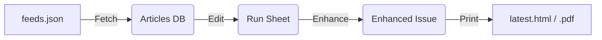

# Fishwrap Engine ⚙️

This directory contains the core source code for Fishwrap.

## Pipeline Modules

The system is designed to be run as a sequence of modules:

### 1. `fishwrap.fetcher`
*   **Input:** RSS Feeds defined in your config.
*   **Process:** Downloads feeds, parses entries, and performs "upserts" into the `articles_db.json`.
*   **Smart Features:** Prioritizes Hacker News comments over link targets.

### 2. `fishwrap.editor`
*   **Input:** `articles_db.json`.
*   **Process:** This is where articles are **classified** and **scored**.
    *   **Classification:** Articles are categorized into sections (News, Tech, Sports, Culture) based on:
        *   **Source Affinity:** Domains explicitly mapped to sections in your config (`SOURCE_SECTIONS`).
        *   **Keywords:** Keyword matching in titles/summaries (`KEYWORDS`).
    *   **Scoring:** Each article receives an "Impact Score", a composite metric reflecting its importance. This score is built from:
        *   **Dynamic Factors:** Votes, Comments (for sites like Hacker News, Reddit), and Freshness.
        *   **Editorial Policies:** Custom rules (`EDITORIAL_POLICIES`) defined in your config can apply boosts or penalties based on keywords, sources, or content.
    *   The `scoring` module (`fishwrap/scoring.py`) handles the detailed calculations.
*   **Output:** `run_sheet.json` (The "Front Page" plan, containing selected and scored articles).

### 3. `fishwrap.enhancer`
*   **Input:** `run_sheet.json`.
*   **Process:** Uses `newspaper3k` to download full article text and authors.
*   **Output:** `enhanced_issue.json`.

### 4. `fishwrap.printer`
*   **Input:** `enhanced_issue.json`.
*   **Process:** Loads the active **Theme** (defined in config) and renders the HTML.
*   **Output:** `latest.html`.

## Configuration

Fishwrap relies on a configuration file injected at runtime via the `FISHWRAP_CONFIG` environment variable.

If `FISHWRAP_CONFIG` is not set, it defaults to an internal schema that defines:
*   `FEEDS`: List of RSS URLs.
*   `THEME`: Path to the theme directory.
*   `EDITION_SIZE`: How many articles per section.
*   `VISUAL_THRESHOLDS`: Score cutoffs for "Lead" vs "Standard" cards.

## Theming

Themes are located in directories containing:
*   `css/style.css`
*   `templates/layout.html`, `card.html`, etc.
*   `static/` (Images/Assets)

The engine automatically loads the theme specified in `config.THEME`.
